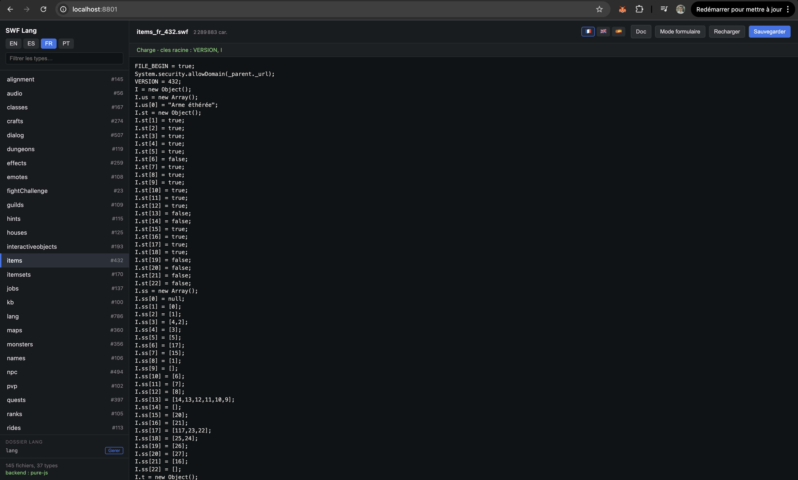
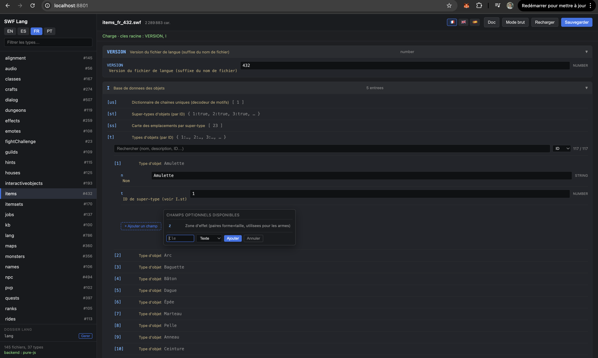
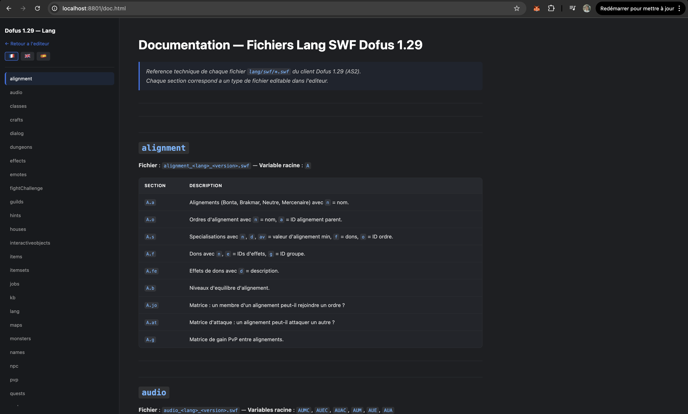

# Dofus 1.29 — SWF Lang Editor

Editeur visuel pour les fichiers `lang/*.swf` de Dofus 1.29 (AS2).
**100 % JavaScript**, aucune dependance externe : pas de Java, pas de FFDec, pas de toolchain Flash.







---

## Installation — macOS

### 1. Installer Node.js

Ouvrir le **Terminal** (Applications > Utilitaires > Terminal).

**Option A — Installeur officiel :**
1. Aller sur https://nodejs.org
2. Telecharger la version **LTS** (bouton vert)
3. Ouvrir le `.pkg` telecharge et suivre l'assistant
4. Verifier dans le Terminal :
```bash
node --version
# v22.x.x ou plus recent
```

**Option B — Via Homebrew** (si Homebrew est deja installe) :
```bash
brew install node
```

### 2. Telecharger le projet

**Si c'est un depot Git :**
```bash
git clone <url-du-depot>
cd <nom-du-depot>/lang/swf-editor
```

**Si c'est une archive ZIP :**
1. Decompresser le ZIP
2. Ouvrir le Terminal et naviguer dans le dossier :
```bash
cd /chemin/vers/le/dossier/swf-editor
```

### 3. Installer les dependances

```bash
npm install
```

Cela installe uniquement `express` (~1 Mo).

### 4. Lancer le serveur

```bash
npm start
```

Le terminal affiche :
```
SWF lang editor listening on http://localhost:8801
```

### 5. Ouvrir l'editeur

Ouvrir un navigateur et aller sur :

**http://localhost:8801**

### 6. Configurer le dossier lang

Au premier lancement, si le dossier `lang/swf/` n'est pas a cote du projet :
1. Cliquer sur **Gerer** dans la barre laterale
2. Soit **saisir le chemin** du dossier `lang` manuellement
3. Soit cliquer **Scanner**, entrer un dossier racine (ex: `~/projets`) et laisser l'app trouver tous les dossiers lang
4. Cliquer sur le dossier souhaite pour l'activer
5. Cliquer sur l'etoile pour le mettre en **favori**

### 7. Arreter le serveur

Dans le Terminal, appuyer sur `Ctrl + C`.

---

## Installation — Windows

### 1. Installer Node.js

**Option A — Installeur officiel (recommande) :**
1. Aller sur https://nodejs.org
2. Telecharger la version **LTS** (bouton vert, fichier `.msi`)
3. Lancer l'installeur, cocher **"Add to PATH"** quand propose
4. Ouvrir **PowerShell** ou **Invite de commandes** (cmd) et verifier :
```powershell
node --version
# v22.x.x ou plus recent
```

**Option B — Via winget** (Windows 10/11) :
```powershell
winget install OpenJS.NodeJS.LTS
```
Fermer et rouvrir le terminal apres installation.

### 2. Telecharger le projet

**Si c'est un depot Git :**
```powershell
git clone <url-du-depot>
cd <nom-du-depot>\lang\swf-editor
```

**Si c'est une archive ZIP :**
1. Clic droit sur le ZIP > **Extraire tout**
2. Ouvrir PowerShell et naviguer dans le dossier :
```powershell
cd C:\chemin\vers\le\dossier\swf-editor
```

### 3. Installer les dependances

```powershell
npm install
```

### 4. Lancer le serveur

```powershell
npm start
```

Le terminal affiche :
```
SWF lang editor listening on http://localhost:8801
```

> **Note Windows :** Si le pare-feu Windows demande l'autorisation, cliquer sur **Autoriser l'acces** (reseau prive uniquement).

### 5. Ouvrir l'editeur

Ouvrir un navigateur et aller sur :

**http://localhost:8801**

### 6. Configurer le dossier lang

Au premier lancement, si le dossier `lang\swf\` n'est pas a cote du projet :
1. Cliquer sur **Gerer** dans la barre laterale
2. Soit **saisir le chemin** du dossier `lang` manuellement (ex: `C:\Dofus\lang`)
3. Soit cliquer **Scanner**, entrer un dossier racine (ex: `C:\Dofus`) et laisser l'app trouver tous les dossiers lang
4. Cliquer sur le dossier souhaite pour l'activer
5. Cliquer sur l'etoile pour le mettre en **favori**

### 7. Arreter le serveur

Dans le terminal, appuyer sur `Ctrl + C`.

---

## Utilisation

### Interface principale

| Zone | Description |
|---|---|
| **Barre laterale** | Choix de la langue du fichier (`fr`, `en`, `es`, `pt`) et du type (`items`, `spells`, `monsters`...) |
| **Drapeaux** | Changer la langue de l'interface (francais / anglais) |
| **Mode Formulaire** | Editer les valeurs via des champs auto-generes avec labels explicatifs |
| **Mode Brut** | Editer directement la source AS2 decompilee |
| **Sauvegarder** | Re-ecrit le SWF en place (backup `.bak` cree automatiquement) |
| **Doc** | Lien vers la documentation technique, pointe vers la section du fichier ouvert |
| **Gerer** | Modale pour gerer les dossiers lang (favoris, recents, scan) |

### Recherche et filtrage (mode formulaire)

Quand une section contient beaucoup d'entrees (objets, monstres, sorts...) :
- **Barre de recherche** : filtre par nom, description, ID ou tout champ texte
- **Tri** : par ID, par nom, ou par champs specifiques (niveau, prix, poids pour les items)

### Ajouter des champs optionnels

En mode formulaire, chaque objet a un bouton **+ Ajouter un champ** qui propose :
- Les champs connus mais absents (d'apres le glossaire technique)
- Un champ personnalise avec choix du type (texte, nombre, booleen, objet, tableau)

### Gestion multi-lang

La modale **Gerer** permet de :
- **Scanner** le PC pour trouver tous les dossiers lang
- **Switcher** entre differents dossiers lang en un clic
- **Mettre en favori** les dossiers importants pour ne pas les perdre
- L'historique des dossiers recents est conserve automatiquement

---

## Prerequis

| Outil | Version | Notes |
|---|---|---|
| Node.js | >= 18 | Teste avec v22, fonctionne sur macOS / Windows / Linux |

C'est tout. Aucun outil tiers requis.

---

## Commandes utiles

```bash
npm start                        # demarrer le serveur
npm install                      # installer les dependances

# macOS/Linux : tuer un serveur en arriere-plan
lsof -i :8801 -t | xargs kill

# Vider le cache de decompilation
rm -rf .cache                    # macOS/Linux
rmdir /s /q .cache               # Windows (cmd)

# Tester l'API
curl -s http://localhost:8801/api/catalog | jq
curl -s http://localhost:8801/api/file/items/fr | jq '.entry'
```

---

## Restaurer un fichier

Chaque sauvegarde cree un backup `*.swf.bak` la premiere fois. Pour revenir a l'original :

```bash
# macOS/Linux
cp lang/swf/items_fr_432.swf.bak lang/swf/items_fr_432.swf

# Windows (cmd)
copy lang\swf\items_fr_432.swf.bak lang\swf\items_fr_432.swf
```

---

## Endpoints API

| Methode | Route | Description |
|---|---|---|
| `GET` | `/api/config` | Configuration actuelle (dossier lang, favoris) |
| `POST` | `/api/config` | Changer le dossier lang |
| `POST` | `/api/config/scan` | Scanner un dossier pour trouver des lang |
| `GET` | `/api/catalog` | Liste des SWF disponibles |
| `GET` | `/api/labels?lang=fr` | Glossaire des champs (FR ou EN) |
| `GET` | `/api/file/:type/:lang` | Lire un fichier SWF |
| `POST` | `/api/file/:type/:lang` | Sauvegarder un fichier SWF |
| `GET` | `/api/doc` | Documentation technique (markdown) |

---

## Architecture interne

```
SWF binary
    |  readSWF()       lib/swf-format.js     (header, tags, zlib inflate)
    v
{ tags: [ ..., DoAction, ... ] }
    |  decodeActions() lib/as2-vm.js         (opcode stream -> action list)
    v
Action list
    |  runVM()         lib/as2-vm.js         (stack VM -> JS object)
    v
{ FILE_BEGIN, VERSION, A | I | M | ..., FILE_END }
    |  serializeAS2()  lib/parser.js         (JS object -> AS2 source)
    v
AS2 source string  <---- affiche dans le textarea "raw", re-parseable en JSON
```

## Limitations connues

- Seuls les SWF AS2 (version SWF <= 8) sont supportes
- Les tags non-`DoAction` sont conserves a l'octet pres
- Le serveur ecoute uniquement sur `localhost` — ne pas exposer publiquement
